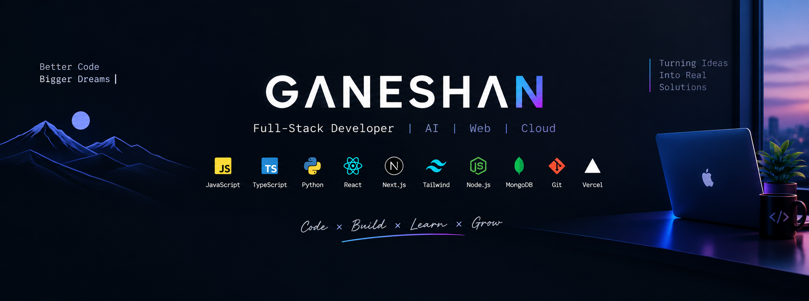

  

# Hey, I'm Ganeshan 👋

### Full-Stack Developer | AI & Web Enthusiast 🚀

I build practical applications with modern web technologies,
AI, and cloud platforms.

---

## 🧑‍💻 About Me

- 🔭 Currently building AI-powered applications
- 🌱 Exploring AI, full-stack development & cloud
- ⚡ I enjoy turning ideas into working products
- 🚀 Deploying projects with Vercel
- 💡 Always learning and experimenting with new technologies

---

## 🛠️ Tech Stack

**Languages**
`JavaScript` `TypeScript` `Python` `HTML` `CSS`

**Frontend**
`React` `Next.js` `Tailwind CSS`

**Backend & Database**
`Node.js` `Express` `MongoDB`

**Tools & Cloud**
`Git` `GitHub` `Vercel`

---

## 🚀 Featured Projects

### 🤖 AI Supply Chain Risk Intelligence
AI-powered application for identifying and analyzing supply-chain risks.

### 🎨 Ganesh Animation
Creative web animation project built for experimenting with modern frontend techniques.

---

## 📊 GitHub Stats

---

## 🔥 Streak

---

## 🌐 Connect With Me

---

### 💻 Code. Build. Learn. Repeat. 🚀
